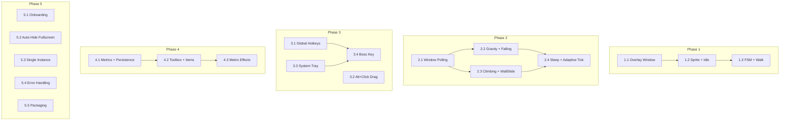

# Development Roadmap

## Desktop Cat Pet — "Mochi"

**Last Updated:** 2026-05-17 (Phase 1, Track 1.3 completed)

Each phase builds on the previous one. Each track within a phase is a **vertical slice** — it touches all layers needed (model, core, UI, tests) to deliver one testable, demoable behavior.

---

## ✅ Phase 0: Project Foundation ✅

> **Goal:** A runnable Python project with dev tooling. No visible output yet.

### Track 0.1 — Scaffold & Dev Environment

**Modules:** `pyproject.toml`, `src/mochi/__init__.py`, `__main__.py`, `main.py`, `config.py`, `src/mochi/utils/logger.py`, `src/mochi/utils/platform.py`

| Task | Status | Detail |
|---|---|---|
| Initialize `pyproject.toml` | ✅ Complete | Name "mochi", version "1.0.0", Python ≥3.11, all deps + dev extras. Ruff (line-length=100, select=E,W,F,I,N,UP,B,SIM,RUF), mypy (strict), pytest, coverage configured |
| Run `uv sync --extra dev` | ✅ Complete | `.venv` created, `uv.lock` generated and committed to VCS |
| Create project directory structure | ✅ Complete | `src/mochi/`, `src/mochi/models/`, `src/mochi/core/`, `src/mochi/ui/`, `src/mochi/utils/`, `tests/`, `assets/sprites/` with all `__init__.py` markers |
| Implement `config.py` | ✅ Complete | 35 tunable constants: physics (GRAVITY=980, TERMINAL_VELOCITY=600, WALK_SPEED=60, CLIMB_SPEED=40, WALL_SLIDE_SPEED=20), FSM timers, pet metrics, rendering, polling, item cooldowns, onboarding duration |
| Implement `logger.py` | ✅ Complete | `setup_logging(debug=False, log_path=None)` with console + file handlers, timestamp format, duplicate-handler guard |
| Implement `platform.py` stubs | ✅ Complete | `get_platform()`, `get_data_dir()`, `is_alt_held()`, `set_click_through()` — Windows click-through implemented via ctypes `WS_EX_TRANSPARENT`, macOS/Linux no-op stubs |
| Implement `main.py` + `__main__.py` | ✅ Complete | `create_application()` → QApplication bootstrap. `main()` → event loop entry. Type-safe `__main__.py` with `if __name__ == '__main__':` guard |
| Tests | ✅ Complete | 4 test suites (test_config, test_logger, test_platform, test_main) — 43 tests, 85% coverage |
| Lint, format, types | ✅ Complete | `ruff check` — zero errors. `ruff format --check` — zero violations. `mypy strict` — zero errors |

**Results:**
- [x] `uv run python -m mochi` launches, logs "Mochi started", opens an empty Qt event loop
- [x] `uv run pytest` discovers 43 tests, all passing with 85% coverage
- [x] `uv run ruff check src/` — zero lint errors
- [x] `uv run ruff format --check src/` — zero formatting violations
- [x] `uv run mypy src/mochi/` — zero type errors
- [x] All config constants are importable from `mochi.config`
- [x] `uv.lock` committed to version control

---

## ✅ Phase 1: Cat On Screen ✅

> **Goal:** A visible, animated cat sprite on a transparent overlay. Walks on the screen bottom. No window awareness yet.
>
> **Status:** All 3 tracks complete — the transparent overlay renders the cat with idle breathing animation and autonomous screen-bottom walking with direction-aware sprite flipping and edge reversal.

### Track 1.1 — Transparent Overlay Window ✅

**Modules:** `canvas.py`, `main.py`, `config.py`, `platform.py`

| Task | Status | Detail |
|---|---|---|
| Create `Canvas` class | ✅ Complete | `QWidget` with `FramelessWindowHint | WindowStaysOnTopHint | Tool` flags |
| Enable transparency | ✅ Complete | `WA_TranslucentBackground`, fullscreen `availableGeometry()` |
| Enable click-through | ✅ Complete | Windows via ctypes `WS_EX_TRANSPARENT`; macOS/Linux stubbed per ROADMAP |
| Render a test rectangle | ✅ Complete | Green (`#00FF00`) 64×64 rect at bottom-center using `SCREEN_BOTTOM_MARGIN_PX` |
| Wire into `main.py` | ✅ Complete | Canvas created in `main()`, shown, dimensions logged, click-through deferred via `QTimer.singleShot(0, ...)` |
| Add screen config constant | ✅ Complete | `SCREEN_BOTTOM_MARGIN_PX: int = 48` in `config.py` |

**Results:**
- [x] A transparent, always-on-top, click-through window covers the primary monitor
- [x] A green 64×64 test rectangle is visible at the bottom-center of the screen (above taskbar)
- [x] Click-through works on Windows (macOS/Linux are no-op stubs — deferred)
- [x] `uv run pytest` — 58 passed, 1 skipped, 93% coverage
- [x] `uv run ruff check src/` — zero lint errors
- [x] `uv run ruff format --check src/` — zero formatting violations
- [x] `uv run mypy src/mochi/` — zero type errors
- [x] Review completed and archived (see `conductor/archive/overlay_window_20260517/`)

### Track 1.2 — Sprite Loading & Idle Animation ✅

**Modules:** `sprites.py`, `canvas.py`, `config.py`

| Task | Status | Detail |
|---|---|---|
| Implement `SpriteSheet` loader | ✅ Complete | `SpriteSheet` class in `sprites.py` — loads PNG, slices into 80x64 frame pixmaps, caches by animation key. Case-insensitive key→filename matching. `asset_path()` helper supports dev, PyInstaller, and Nuitka modes |
| Auto-center sprite frames | ✅ Complete | `_autocenter_frame()` detects non-transparent content bounds and re-centers each frame within the canvas cell, eliminating sliding effects in the animation |
| Render idle sprite | ✅ Complete | Canvas `paintEvent` draws the current idle frame via `QPainter.drawPixmap()` at screen bottom-center. Green rectangle completely removed |
| Add animation timer | ✅ Complete | `QTimer` at 200ms (5 FPS), advances frame index counting modulo frame count, calls `update()` each tick |
| Idle breathing cycle | ✅ Complete | 8-frame looping idle animation from `IDLE.png` (640x80 sheet, 80x64 cells, 32x32 sprite content auto-centered) |
| Screen geometry fallback | ✅ Complete | `_screen_geo` stored at construction, used as fallback in `paintEvent` if `primaryScreen()` returns None |

**Results:**
- [x] Cat sprite visible at screen bottom with smooth, stable idle breathing animation (1.6s full cycle)
- [x] `SpriteSheet` loader verified with all sprite PNGs (16 sheets, varying widths all divisible by 80)
- [x] Non-conforming sprites (BOWL.png 16x16) handled gracefully — logged, skipped
- [x] `uv run pytest` — **79 passed, 1 skipped, 93% coverage**
- [x] `uv run ruff check src/` — zero lint errors
- [x] `uv run mypy src/mochi/` — zero type errors
- [x] User confirmed and reviewed — see `conductor/archive/sprite_idle_20260517/`

### Track 1.3 — Basic FSM + Walk on Screen Bottom ✅

**Modules:** `fsm.py`, `physics.py`, `canvas.py`

| Task | Status | Detail |
|---|---|---|
| Implement `FSM` class | ✅ Complete | `PetState` (Idle, Walk, EdgePause), `tick(dt)` method, random timers from config, same-state no-op guard, DEBUG-level logging |
| Implement `Physics` class | ✅ Complete | `x`/`y` position, `direction` (+1/-1), `update(dt, state, screen_width, sprite_width, surfaces=None)` — frame-rate-independent movement at `WALK_SPEED * dt`, pre/post edge detection with half-sprite overshoot |
| EdgePause state | ✅ Complete | Cat pauses 0.5–1s at screen edge, then reverses direction and continues walking |
| Walk animation | ✅ Complete | Loads `WALK.png` frames alongside idle, switches sprite key per state, flips via `QPainter.scale(-1, 1)` when walking right (sprites face left by default) |
| Adaptive tick rate | ✅ Complete | 100ms during Walk (10 FPS), 250ms during Idle/EdgePause (4 FPS), adjusted on each FSM transition |
| Wire FSM into canvas tick | ✅ Complete | `fsm.tick(dt)` → sync direction → `physics.update(dt, ...)` → edge detect → swap sprite key → advance frame → adjust timer → repaint |
| Expose FSM/Physics | ✅ Complete | Re-exported through `src/mochi/core/__init__.py` |

**Tests:**
- `test_fsm.py`: 15 tests — Idle→Walk/Walk→Idle transition timer ranges, EdgePause→Walk, same-state no-op, direction reversal on EdgePause exit, DEBUG logging
- `test_physics.py`: 21 tests — horizontal displacement, left/right edge detection, half-sprite overshoot, direction-aware edge signalling (no reversal by physics), position clamping, API surface
- `test_animation.py`: Updated for new Canvas API, 1 new adaptive tick rate test
- Run: `uv run pytest` — all 116 tests pass

**Results:**
- [x] Cat idles for 2–5s, walks left/right at 60px/s, pauses 0.5–1s at edges, reverses direction — in a loop
- [x] Walk sprite flipped for rightward movement; idle sprite respects last movement direction
- [x] `uv run pytest` — **116 passed, 1 skipped, 94% coverage**
- [x] `uv run ruff check src/` — zero lint errors
- [x] `uv run ruff format --check src/` — zero formatting violations
- [x] `uv run mypy src/mochi/` — zero type errors
- [x] Review completed and archived (see `conductor/archive/basic_fsm_walk_20260517/`)

---

## Phase 2: Environmental Awareness

> **Goal:** The cat interacts with real application windows — walks on them, falls off them, climbs edges.

### Track 2.1 — Window Polling & Surface Detection

**Modules:** `environment.py`, `physics.py`

| Task | Detail |
|---|---|
| Implement `EnvironmentPoller` | `QThread` + `QTimer` (300ms), calls `pywinctl.getAllWindows()` |
| Build surface list | Convert window rects to `list[Surface]` — window tops, screen edges, screen bottom |
| Filter windows | Exclude minimized, empty-title, and the Mochi overlay itself |
| Emit `platforms_updated` signal | Main thread receives updated surface list |
| Ground detection in physics | Cat snaps to nearest surface below it instead of only screen bottom |

**Tests:**
- `test_physics.py`: Given mock surfaces, cat lands on the correct one.

**Definition of Done:**
- [ ] Cat walks on the **top edge of real application windows**, not just screen bottom
- [ ] Opening/moving a window below the cat gives it a new platform
- [ ] Console log shows surface list updating every 300ms

### Track 2.2 — Gravity & Falling

**Modules:** `fsm.py`, `physics.py`

| Task | Detail |
|---|---|
| Add Fall state to FSM | Walk→Fall transition when surface is lost |
| Implement gravity | `velocity_y += GRAVITY * dt`, capped at `TERMINAL_VELOCITY` |
| Landing detection | When `pet_bottom >= surface_top`, snap to surface, zero velocity, transition to Idle |
| Fall animation | Switch to fall sprite during descent |
| Screen bottom as last resort | If no window surface below, land on screen bottom |

**Tests:**
- `test_physics.py`: Gravity accelerates correctly. Terminal velocity caps. Landing snaps position and zeroes velocity.
- `test_fsm.py`: Walk→Fall on surface loss. Fall→Idle on landing.

**Definition of Done:**
- [ ] Closing or moving a window under the cat causes it to **fall with acceleration**
- [ ] Cat lands on the next window below, or on screen bottom
- [ ] Fall animation plays during descent

### Track 2.3 — Climbing & Wall Slide

**Modules:** `fsm.py`, `physics.py`

| Task | Detail |
|---|---|
| Add Climb and WallSlide states to FSM | Walk→Climb at vertical surface. Climb→WallSlide on timer. WallSlide→Fall at bottom |
| Lateral collision detection | Detect screen edges and window sides as vertical surfaces |
| Vertical movement | Climb: move Y upward at `CLIMB_SPEED`. WallSlide: move Y downward at `WALL_SLIDE_SPEED` |
| Summit transition | Climb→Walk when reaching the top edge of the climbed surface |
| Climb/WallSlide animations | Switch sprite keys appropriately |

**Tests:**
- `test_fsm.py`: Walk→Climb at edge. Climb→Walk at summit. Climb→WallSlide on timer. WallSlide→Fall at bottom.
- `test_physics.py`: Vertical movement applies at correct speeds. Summit detection works.

**Definition of Done:**
- [ ] Cat climbs screen edges when it walks into them
- [ ] Cat reaches the top and transitions to walking along the top edge
- [ ] Cat occasionally slides down, then either re-climbs or falls
- [ ] All climb/slide/fall transitions are smooth with correct animations

### Track 2.4 — Sleep State

**Modules:** `fsm.py`

| Task | Detail |
|---|---|
| Add Sleep state to FSM | Idle→Sleep on random timer (30–60s of continuous idle) |
| Sleep→Idle | On timer (15–45s) or user interaction (wired in Phase 3) |
| Sleep animation | 4-frame breathing cycle at reduced tick rate |
| Adaptive tick rate | Implement state-based timer interval: 100ms active, 250ms idle, 500ms sleep |

**Tests:**
- `test_fsm.py`: Idle→Sleep transition fires. Sleep→Idle on timer. Timer rate changes per state.

**Definition of Done:**
- [ ] Cat eventually curls up and sleeps after prolonged idle
- [ ] Sleep animation plays with slow breathing
- [ ] CPU usage drops noticeably during sleep (verify via Task Manager)

---

## Phase 3: User Interaction

> **Goal:** The user can interact with the cat via hotkeys, toolbox, and drag. Click-through toggles correctly.

### Track 3.1 — Global Hotkeys (InputBridge)

**Modules:** `input_bridge.py`, `platform.py`

| Task | Detail |
|---|---|
| Implement `InputBridge` for Windows | `RegisterHotKey` for `Ctrl+Shift+P` and `Ctrl+Shift+H`, `QAbstractNativeEventFilter` for `WM_HOTKEY` |
| Emit Qt signals | `toolbox_requested` and `boss_key_pressed` signals |
| Stub macOS/Linux | Log a warning that hotkeys are not yet implemented on this platform |
| Wire into `main.py` | Connect signals to placeholder handlers (log to console) |
| Unregister on shutdown | `UnregisterHotKey` in `QApplication.aboutToQuit` |

**Definition of Done:**
- [ ] Pressing `Ctrl+Shift+P` anywhere on the desktop logs "toolbox requested"
- [ ] Pressing `Ctrl+Shift+H` anywhere logs "boss key pressed"
- [ ] Hotkeys don't interfere with other applications
- [ ] Hotkeys are cleaned up on app exit

### Track 3.2 — Alt+Click Drag (Grabbed State)

**Modules:** `fsm.py`, `canvas.py`, `platform.py`

| Task | Detail |
|---|---|
| Implement `is_alt_held()` for Windows | `GetAsyncKeyState(VK_MENU)` via ctypes |
| Poll Alt state on each tick | When Alt is held, call `set_click_through(False)` |
| Mouse event handling | `mousePressEvent` → enter Grabbed state. `mouseMoveEvent` → follow cursor. `mouseReleaseEvent` → enter Fall |
| Grabbed animation | Switch to grabbed/dangling sprite |
| Restore click-through | When Alt is released and not grabbed, re-enable click-through |

**Definition of Done:**
- [ ] Holding Alt and clicking the cat picks it up
- [ ] Cat follows the cursor while dragged
- [ ] Releasing drops the cat, which falls with gravity to the nearest surface
- [ ] Click-through resumes after release

### Track 3.3 — System Tray Icon

**Modules:** `tray_icon.py`

| Task | Detail |
|---|---|
| Create `QSystemTrayIcon` | App icon (placeholder), tooltip "Mochi" |
| Context menu | Show/Hide, Open Toolbox, Stats (placeholder), About, Quit |
| Show/Hide action | Toggle canvas visibility (freeze/resume FSM timer) |
| Quit action | Save state, unregister hotkeys, exit cleanly |
| Wire into `main.py` | Create tray icon at startup |

**Definition of Done:**
- [ ] Tray icon visible in system notification area
- [ ] Right-click shows context menu with all items
- [ ] Show/Hide toggles the cat's visibility
- [ ] Quit exits the app cleanly

### Track 3.4 — Boss Key

**Modules:** `canvas.py`, `tray_icon.py`, `input_bridge.py`

| Task | Detail |
|---|---|
| Connect `boss_key_pressed` signal | Toggle a `_hidden` flag on the canvas |
| Hide behavior | Stop animation timer, hide canvas, hide tray icon, hide any deployed items |
| Restore behavior | Resume timer, show canvas at last position, show tray icon |
| Double-click tray | Connect `QSystemTrayIcon.activated` to same toggle |
| State preservation | Freeze FSM state and position on hide |

**Definition of Done:**
- [ ] `Ctrl+Shift+H` hides everything — no visible trace
- [ ] Pressing it again restores the cat at the exact position it was hidden
- [ ] Double-clicking tray icon also toggles visibility
- [ ] Animation timer is fully stopped when hidden (zero CPU)

---

## Phase 4: Pet Lifecycle

> **Goal:** The cat has needs. Metrics persist, decay, and affect behavior. The toolbox lets the user care for the cat.

### Track 4.1 — Metrics & Persistence

**Modules:** `pet_state.py`, `platform.py`

| Task | Detail |
|---|---|
| Implement `PetState` class | Hunger, Boredom, Affection (0–100), position, FSM state, `last_exit_epoch`, `first_run_completed` |
| Platform data directory | `get_data_dir()` → `%APPDATA%\Mochi` (Windows), `~/Library/Application Support/Mochi` (macOS), `~/.local/share/mochi` (Linux) |
| JSON serialization | `save()` and `load()` with schema version |
| Write debouncing | Buffer changes in memory, flush every 5s via `QTimer` + flush on quit |
| Corruption recovery | Detect malformed JSON, backup to `.bak`, reset to defaults |
| Offline decay | On load: `hours = min(Δt/3600, 48)`, apply decay per metric |

**Tests:**
- `test_pet_state.py`: Save/load round-trip. Decay calculation at 1h, 10h, 100h (capped at 48). Corruption recovery. Boundary clamping 0–100.
- Run: `uv run pytest tests/test_pet_state.py`

**Definition of Done:**
- [ ] State file created on first run at correct platform path
- [ ] Quit and relaunch preserves position and metrics
- [ ] After manually editing `last_exit_epoch` to simulate 10h offline, metrics have decayed on relaunch
- [ ] Corrupt JSON triggers recovery (rename + defaults)

### Track 4.2 — Toolbox UI & Items

**Modules:** `toolbox.py`, `canvas.py`, `fsm.py`

| Task | Detail |
|---|---|
| Create `Toolbox` widget | Semi-transparent floating panel, 4 icon buttons (Food, Yarn, Pet, Box) |
| Toolbox positioning | Appears at current cursor position |
| Click-through mode toggle | Disable click-through when toolbox opens, re-enable on dismiss |
| Dismiss behavior | Click outside, Escape, or hotkey toggle — consume the dismiss-click |
| Cooldown enforcement | Gray out buttons during cooldown, show countdown |
| Item placement | Place item sprite on cat's current surface at nearest X to cursor |
| Best-effort approach | FSM walks cat toward item. 15s timeout cancels approach |
| Metric update on arrival | Apply metric change when cat reaches item. Play interaction animation (eat/play/pet) |
| Cardboard Box | Special item: cat enters box → non-disruptive idle loop. Auto-remove after 60s |

**Definition of Done:**
- [ ] `Ctrl+Shift+P` opens toolbox at cursor
- [ ] Clicking Food Dish places it; cat walks to it and eats; Hunger → 100
- [ ] Clicking Yarn Ball; cat plays; Boredom → 100
- [ ] Pet/Stroke increases Affection +25
- [ ] Cardboard Box contains the cat for 60s
- [ ] Cooldowns are enforced and visually indicated
- [ ] Toolbox is dismissible via all three methods

### Track 4.3 — Metric Effects on Behavior

**Modules:** `fsm.py`, `physics.py`

| Task | Detail |
|---|---|
| Low Hunger effect | `Hunger < 20` → reduce walk speed by 30%, occasional pause animation |
| Low Boredom effect | `Boredom < 20` → prioritize Sleep in FSM transition weights |
| Low Affection effect | `Affection < 20` → cat walks away from cursor position (poll cursor, walk opposite direction) |
| Happy zoomie | All metrics > 70 → 5% chance per Idle→Walk transition of a brief sprint |
| Drag affection bonus | On drop from Grabbed state, increase Affection +5 |

**Definition of Done:**
- [ ] Manually set Hunger to 10 → cat walks noticeably slower
- [ ] Manually set Boredom to 10 → cat sleeps much more frequently
- [ ] Manually set Affection to 10 → cat avoids the cursor
- [ ] All metrics at 80 → occasional zoomie sprint occurs

---

## Phase 5: Polish & Production

> **Goal:** First-run experience, edge cases, single-instance, auto-hide, and packaging.

### Track 5.1 — Onboarding Tooltip

**Modules:** `onboarding.py`, `pet_state.py`

| Task | Detail |
|---|---|
| Create tooltip widget | Translucent rounded rectangle with down-arrow, positioned above the cat |
| Positioning logic | 60px minimum clearance from screen bottom |
| Content | Hotkey bindings text |
| Auto-dismiss | Fade out after 8s using `QPropertyAnimation` on opacity |
| One-time display | Check `first_run_completed` in state. Set to `true` after showing |

**Definition of Done:**
- [ ] Delete `pet_state.json`, launch → tooltip appears above cat with correct hotkeys
- [ ] Tooltip fades out after 8 seconds
- [ ] Second launch → no tooltip

### Track 5.2 — Auto-Hide in Fullscreen

**Modules:** `environment.py`, `canvas.py`

| Task | Detail |
|---|---|
| Fullscreen detection | Use `pymonctl` to get monitor geometry, compare against window geometries each poll |
| Emit `fullscreen_changed(bool)` | Signal from poller to main thread |
| Auto-hide | On `fullscreen_changed(True)` → hide cat (but not via Boss Key — use a separate `_auto_hidden` flag) |
| Auto-show | On `fullscreen_changed(False)` → show cat, unless Boss Key is active |
| Boss Key precedence | Boss Key hidden state takes priority over auto-hide |

**Definition of Done:**
- [ ] Open a fullscreen video or game → cat auto-hides
- [ ] Exit fullscreen → cat reappears
- [ ] Boss Key hide + fullscreen exit → cat stays hidden (Boss Key wins)

### Track 5.3 — Single-Instance Enforcement

**Modules:** `platform.py`, `main.py`

| Task | Detail |
|---|---|
| Windows: Named mutex | `CreateMutexW` via ctypes. If mutex already exists, send show signal |
| Show signal (Windows) | Find existing Mochi window by class name, send custom `WM_USER` message |
| macOS/Linux: Unix socket | Attempt to bind a socket at a known path. If bound, send "show" command |
| Second instance behavior | Send show, log message, exit immediately |

**Definition of Done:**
- [ ] Launch Mochi. Boss Key hide. Launch Mochi again → first instance unhides, second exits
- [ ] No duplicate tray icons or hotkey conflicts

### Track 5.4 — Error Handling & Edge Cases

**Modules:** All modules

| Task | Detail |
|---|---|
| Hotkey registration failure | Show tray notification if `RegisterHotKey` fails |
| No windows open | Cat falls to screen bottom, walks normally |
| Window closed during climb | Cat enters Fall state immediately |
| macOS permission dialog | Detect Accessibility denial, show one-time dialog |
| Logging coverage | Ensure all error paths log at WARNING or ERROR level |

**Definition of Done:**
- [ ] Register a conflicting hotkey (e.g., via another app), launch Mochi → tray notification shown, app doesn't crash
- [ ] Close all windows → cat walks on screen bottom without errors
- [ ] Close a window while cat is climbing it → cat falls correctly

### Track 5.5 — Packaging & Distribution

**Modules:** Build scripts, CI configuration

| Task | Detail |
|---|---|
| PyInstaller dev build | `--onefile --windowed` with Qt module exclusions. Verify it runs |
| Nuitka release build | `--onefile` with PySide6 plugin. Verify it runs |
| Asset path resolution | `asset_path()` works correctly in dev, PyInstaller, and Nuitka modes |
| Windows smoke test | Built `.exe` runs on a clean Windows 10 VM without Python installed |
| macOS smoke test | Built `.app` runs on macOS 12+ (stretch goal) |
| Binary size validation | Verify against size targets (Nuitka < 25 MB, PyInstaller < 45 MB) |

**Definition of Done:**
- [ ] `Mochi.exe` runs on a clean Windows machine
- [ ] All features work identically in the packaged build
- [ ] Binary size meets target

---

## Phase Dependency Graph

## Track Dependency Map (Within Phases)

---

## Summary

| Phase | Tracks | Key Deliverable |
|---|---|---|
| **Phase 0** | 1 | Runnable project skeleton |
| **Phase 1** | 3 | Visible animated cat walking on screen bottom |
| **Phase 2** | 4 | Cat interacts with real windows — walks, falls, climbs, sleeps |
| **Phase 3** | 4 | User can interact — hotkeys, drag, tray, boss key |
| **Phase 4** | 3 | Tamagotchi lifecycle — metrics, toolbox, behavioral effects |
| **Phase 5** | 5 | Polish, edge cases, packaging for distribution |
| **Total** | **20 tracks** | **Full MVP** |
